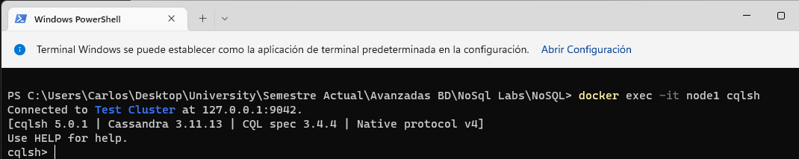
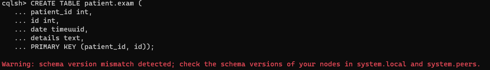
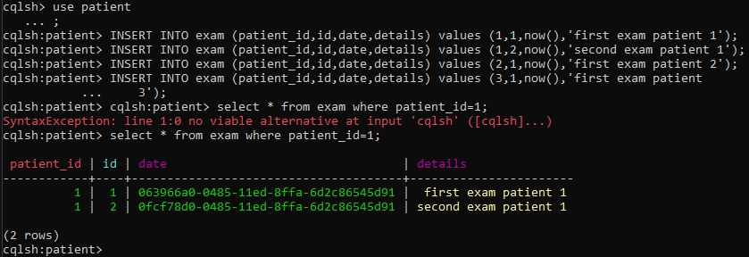
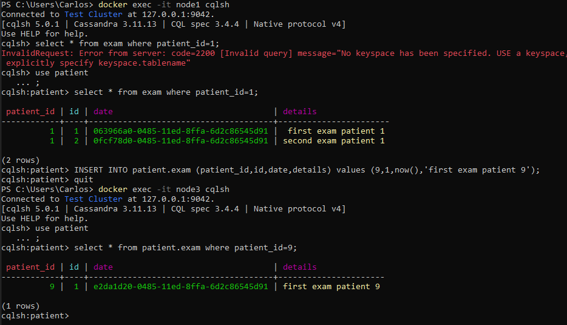
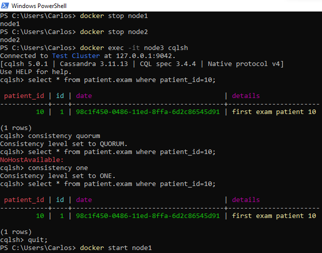
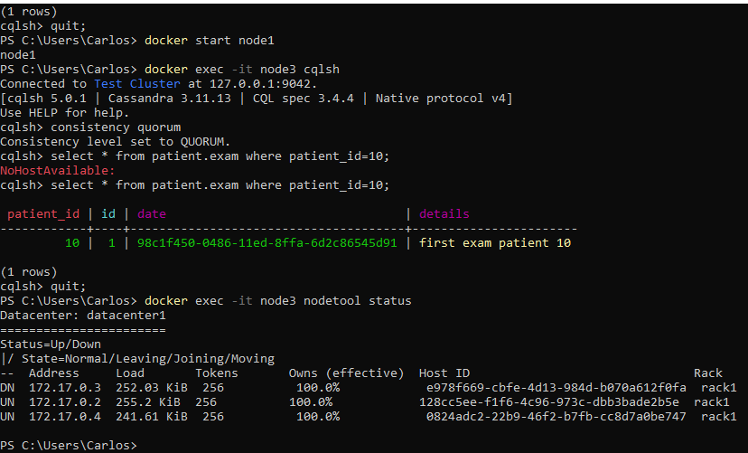

# Laboratorato NoSQL #2- Cassandra
**Curso**

Base de Datos Avanzadas

**Estudiante**

Juan Valverde Campos - B47200

**Profesor**

David González Pérez

**Material del Laboratorio**

Disponible en [tutorial de IBM](https://developer.ibm.com/tutorials/ba-set-up-apache-cassandra-architecture/)

# Introducción 

# 1. Generalidades de Cassandra 

# 2. Resultados del laboratorio 

## Tarea 1. 

En esta tarea se observa como ...

## Tarea 2. 

En esta tarea se observa como ...

## Tarea 3. 

En esta tarea se observa como ...

## Tarea 4. 

En esta tarea se observa como ...

## Tarea 5. 

En esta tarea se observa como ...

## Tarea 6. 
.png)
.png)

En esta tarea se observa como ...

## Tarea 7. 

En esta tarea se observa como ...
