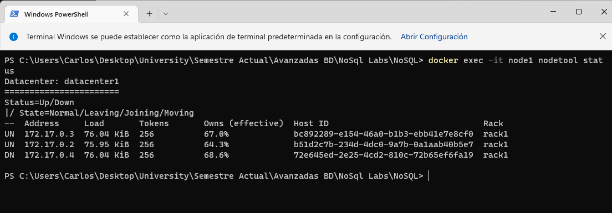

# Laboratorato NoSQL #2- Cassandra
**Curso**

Base de Datos Avanzadas

**Estudiante**

Juan Valverde Campos - B47200

**Profesor**

David González Pérez

# Introducción 

https://developer.ibm.com/tutorials/ba-set-up-apache-cassandra-architecture/

Según la [página oficial de docker](https://docs.docker.com/desktop/), se tiene lo siguiente:

