# Laboratorato NoSQL #3- Neo4j
**Curso**

Base de Datos Avanzadas

**Estudiante**

Juan Valverde Campos - B47200

**Profesor**

David González Pérez

**Material del Laboratorio**

Disponible en [Instrucciones de Laboratorio](LabInstructions.pdf)
# Introducción 

# Parte 1. Creación y consultas básicas 

## P1. ¿Cuál es la orientación de Neo4j y en qué situaciones del mundo real se emplea?

Según la [página oficial de Neo4j](https://neo4j.com/product/) la orientación de la misma es orientada a gráfos. En donde no únicamente se guardan los datos sino también las relaciones existentes entre estos, todo al mismo tiempo.

En el mundo real Neo4j en su misma página establece un [segmento](https://neo4j.com/use-cases/) de casos de uso en donde destaca el uso de estos tipos de gráficos para realizar detección de fraudes, gráficos de conocimiento, recomendaciones en tiempo real, la administración de cadena de suministros entre otras muchas aplicaciones.

## P2. Muestre las etiquetas que aparecen en Neo4j Browser y establezcan las relaciones que existen

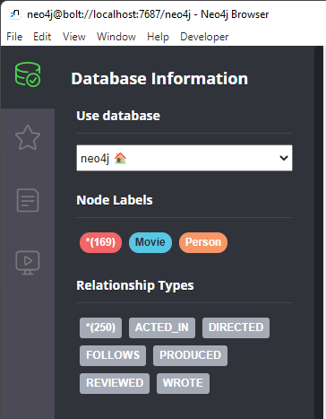

## P3. ¿Qué resultado se obtiene con el siguiente comando?

    CREATE (n:Persona{nombre: 'Juanito', edad: 24})

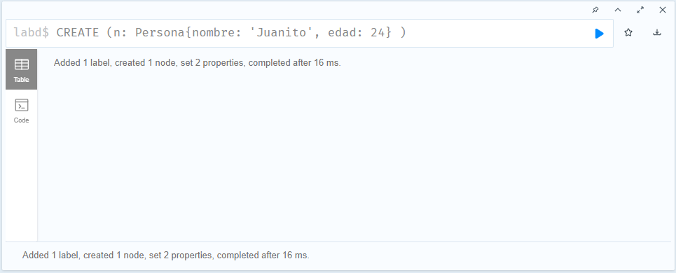

## P4. ¿Qué elementos nuevos se adquirieron con la anterior consulta?

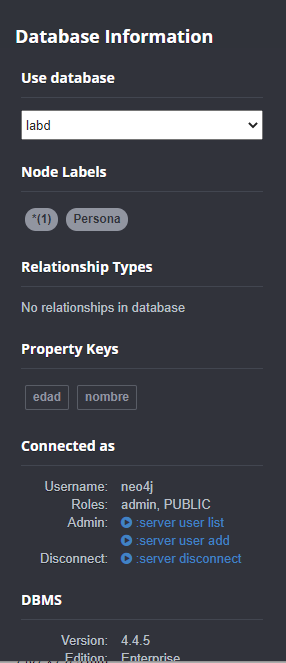

## P5. ¿Qué resultados obtiene si realiza click en Persona?

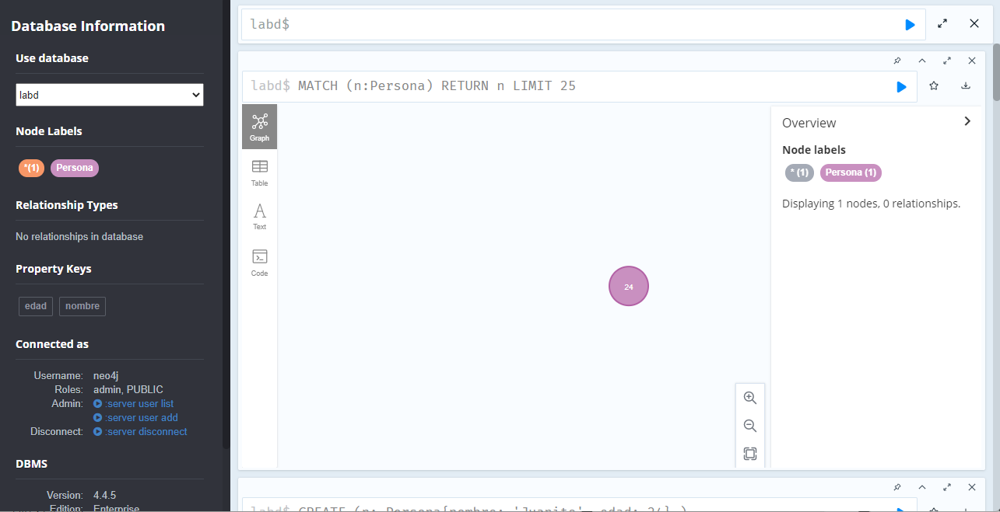

## P6. ¿Qué sucede si ahora realiza la siguiente consulta y realiza un click en Persona?

    CREATE (n:Persona{nombre: 'Miguel', edad: 26, ocupacion: 'Desarrollador'})

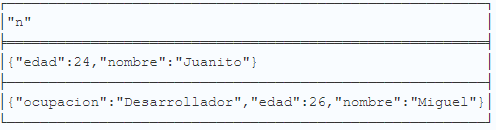

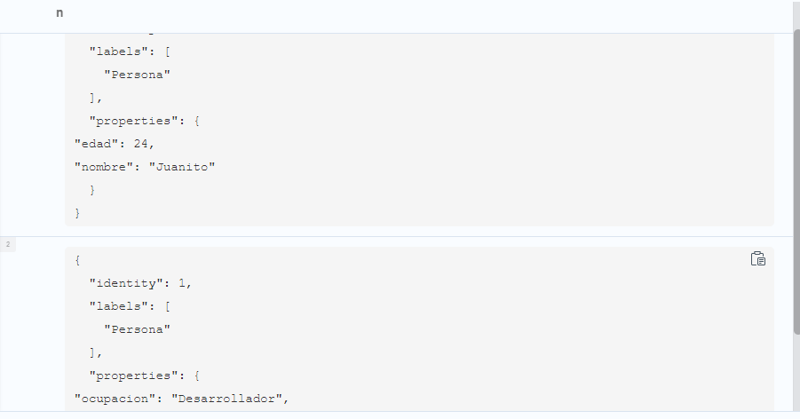

## P7. ¿Es posible obtener este resultado en un motor SQL ?

Si es posible obtener estos resultados de forma cruda (obtener los datos que se requieren), a partir del uso de JOIN entre tablas, no obstante tanto a nivel de visualización o formas de presentación al usuario es claro que se requeriría tal vez incluso otros programas para obtener estos resultados. Además lo más destacable es que la usabilidad de este motor contrario al de SQL es que es mucho más amigable y de fácil acceso.

## P8. ¿Qué resultado se obtiene al realizar la siguiente consulta?
    MATCH (a:Persona), (b:Persona) 
    WHERE a.nombre = 'Juanito' AND b.nombre = 'Miguel'
    CREATE (a)-[r:Conoce_A]->(b)

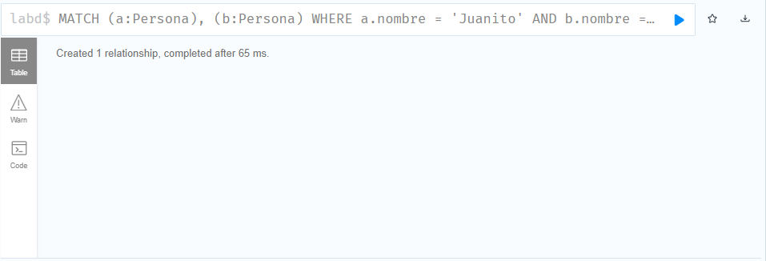

## P9. ¿Qué resultado se obtiene al realizar la siguiente consulta?

    CREATE (:Persona{nombre: 'Juana'}) - [:Conoce_A {desde: 2016}] -> (:Persona {nombre: 'Pablo'})

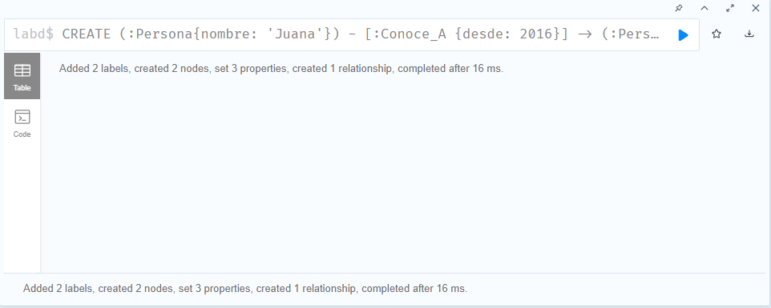

## P10. Estableza la diferencia de las relaciones (a nivel de propiedades) de Juanito y Miguel y la de Juana y Pablo, cuando se marca la etiqueta Persona

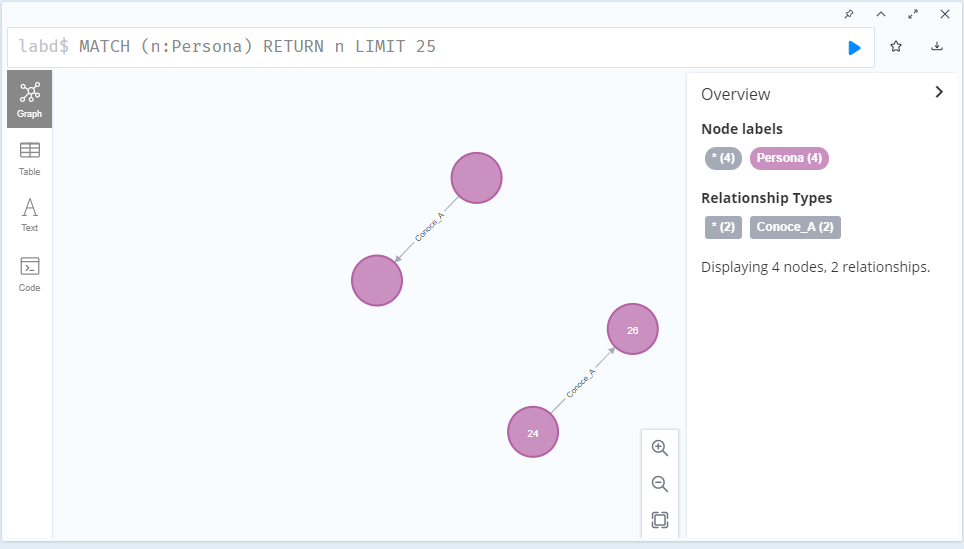

## P11. ¿A qué tipo de grafo corresponde una base dedatos en Neo4j? Explique.

## P12. ¿Qué resultado se obtiene al realizar la siguiente consulta?

    MATCH (p:Persona)-[:Conoce_A]->() RETURN DISTINCT p

## P13. ¿Por qué se retornan solo dos nodos?

## P14. Modifique la consulta para se retornen todos los nodos Persona que participan en la relación Conoce_A

    MATCH (p:Persona)-[:Conoce_A]->(pp:Persona) RETURN DISTINCT p,pp

# Parte 2. Consultas con base de datos Movie

## P1. Enliste los diferentes tipos de nodos y relaciones (por separado) que existen en la bse de datos Movies predeterminada.

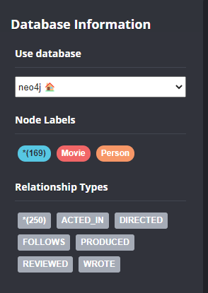

## P2. ¿Qué sucede si se hace click en el nodo Person ?

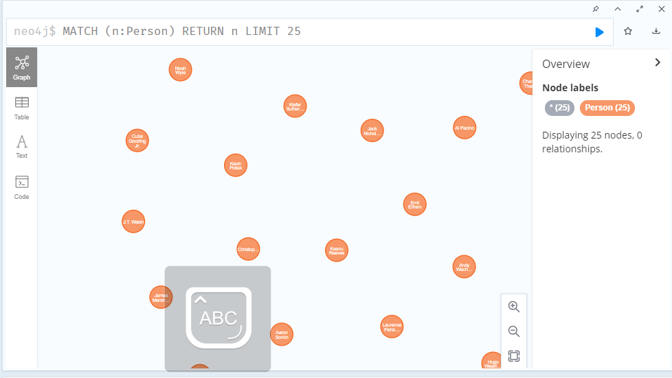

## P3. ¿Qué sucede si se hace click en el nodo ACTED_IN?

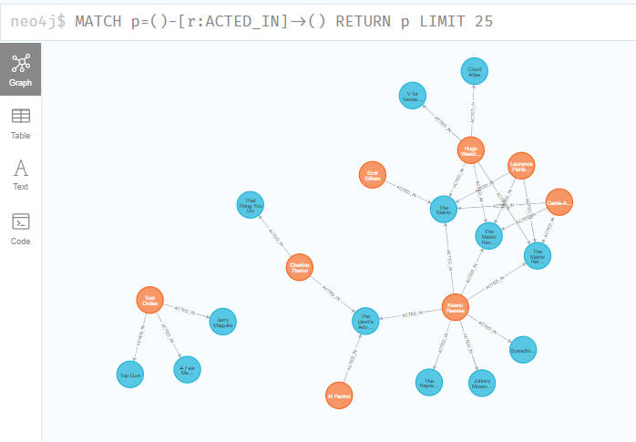

## P4. Muestre una relación de algún actor (Keanu Reeves) con la relación ACTED_IN

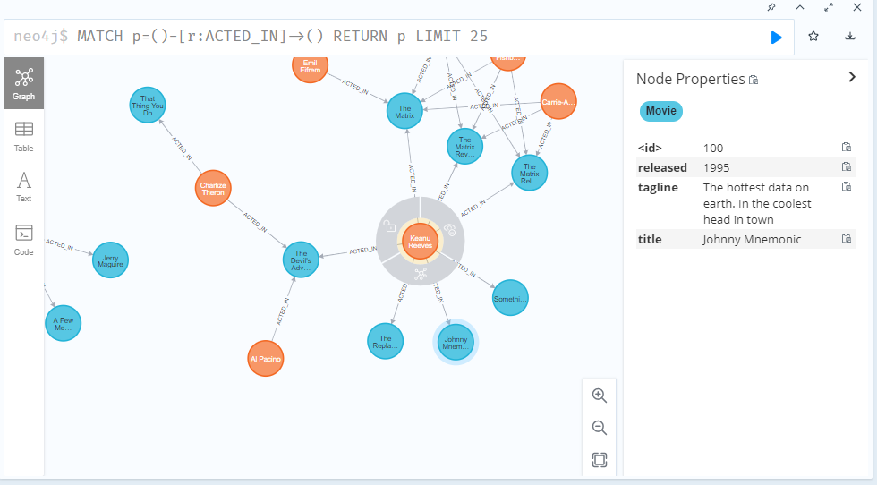

## P5. ¿Qué resultado se obtiene a partir de la siguiente consulta?

    MATCH (p:Person)-[:ACTED_IN]-()-[:ACTED_IN]-(actor:Person) WHERE p.name = "Natalie Portman" RETURN DISTINCT actor

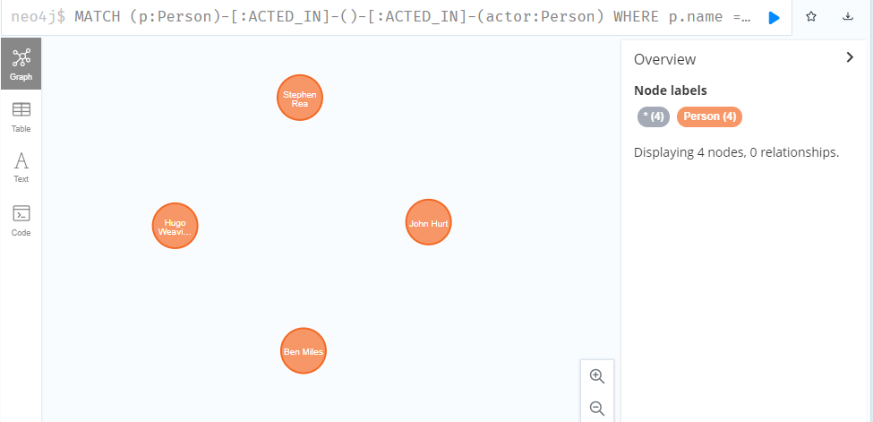

## P6. Modifique la consulta anterior para que también muestre la película en que estos actores participaron

    MATCH (p:Person)-[:ACTED_IN]-(movie:Movie)-[:ACTED_IN]-(actor:Person)
    WHERE p.name = "Natalie Portman"
    return movie, actor

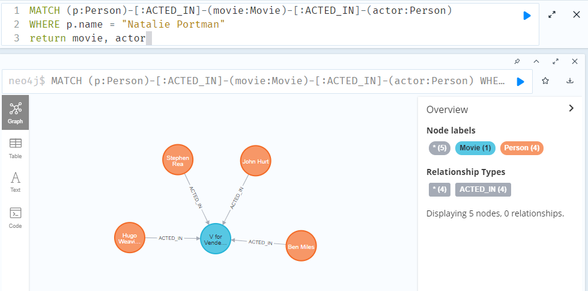

## P7.Realice una consulta que permita encontrar los directores de películas en que ha participado Keanu Reeves

    MATCH (p:Person)-[:ACTED_IN]-(movie:Movie)-[:DIRECTED]-(director:Person)
    WHERE p.name = "Keanu Reeves"
    return movie, director

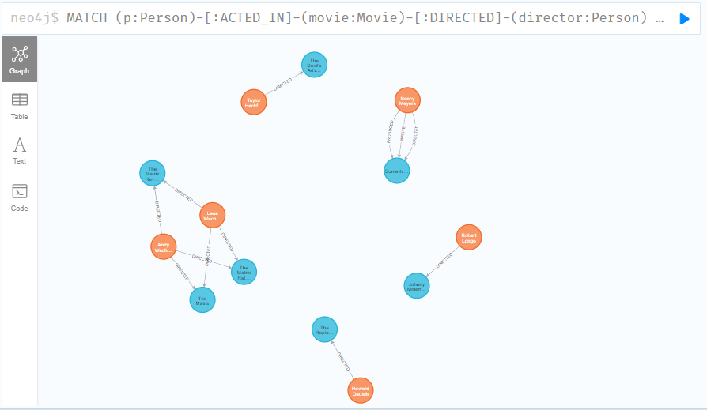

## P8. Realice una consulta que muestre las películas de otros actores que han trabajado junto con Natalie Portman 

    MATCH (p:Person)-[:ACTED_IN]-(:Movie)-[:ACTED_IN]-(actor:Person)-[:ACTED_IN]-(movie:Movie)
    WHERE p.name = "Natalie Portman"
    return movie,actor

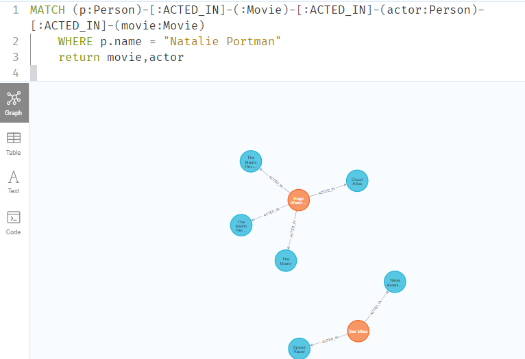

    MATCH (p:Person)-[:ACTED_IN]-(m:Movie)-[:ACTED_IN]-(actor:Person)
    WHERE p.name = "Natalie Portman" 
    With actor
    MATCH (actor)-[:ACTED_IN]-(movie:Movie)
    return actor,movie

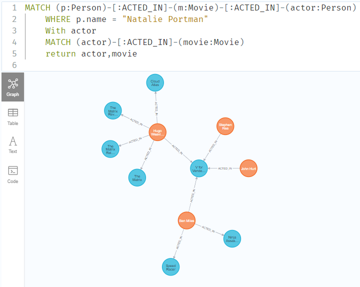

## P9. ¿Qué funciones podrían consultas similares a la anterior en actividades de la vida cotidiana?. Al menos dos ejemplos.

* Ejemplo 1: Conocer los **restaurantes** que **visitan** las **personas** que **visitan** (valga la redundancia) con la misma regularidad que **yo** visito mi **restaurante** **favorito**, para así crear sistemas de recomendación.

* Ejemplo 2: Conocer que artículos recomendar, a partir de **artículos** **comprados** por otras **personas** , quienes **compraron**  un **artículo** similar al **artículo** que acaba de comprar yo.

# Parte 3. Preguntas de Análisis

## P1. ¿Qué similitudes y diferencias encuentra en  Neo4j y los motores de bases de datos relacionales, distribuidas y llave valor?

# P2. Liste los resultados de al menos dos de cada una y  fundamente sus afirmaciones.

