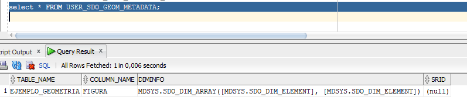

# Tarea de Base de Datos Espaciales - Oracle
**Curso**

Base de Datos Avanzadas

**Estudiante**

Juan Valverde Campos - B47200

**Profesor**

David González Pérez

**Material del Laboratorio**

Disponible en [Instrucciones de Laboratorio](Tarea_Espaciales.pdf)

# Introducción

Este laboratorio consiste en dar una introducción a las bases de datos espaciales utilizando Oracle DataBase XE y sql developer. El laboratorio se centra en su primera etapa en realizar una comprensión general entorno a las bases de datos especiales, donde en la segunda etapa se aborda consultas específicas alrededor de la misma. 

**Nota:** La realización de este laboratorio y su código relacionado se encuentra en el siguiente [archivo](code.sql).

# Laboratorio Parte 1 - Comprensión de BD espaciales

## P1. Explique qué realiza la siguiente consulta 

    CREATE TABLE Ejemplo_Geometria(
    ID NUMBER PRIMARY KEY,
    Nombre VARCHAR2(32),
    Figura SDO_GEOMETRY);

La consulta crea una tabla llamada Ejemplo_Geometria que contiene un identificador como llave primaria, un nombre y una figura que contiene un objeto espacial de tipo SDO_GEOMETRY, el cual será explicado más adelante.

## P2. Explique qué realiza el siguente código y cuál es su finalidad

   INSERT INTO user_sdo_geom_metadata( TABLE_NAME, COLUMN_NAME, DIMINFO, SRID) VALUES (
    'Ejemplo_Geometria',
    'Figura',
    SDO_DIM_ARRAY( SDO_DIM_ELEMENT('X', 0, 20, 0.005), SDO_DIM_ELEMENT('Y', 0, 20, 0.005) ),
    NULL); 

Lo que realiza dicha consulta es ingresar la tabla Ejemplo_Geometria como parte de los metadatos espaciales que maneja Oracle dentro del esquema de la base de datos que actualmente se este utilizando. 

Su finalidad radica en básicamente indicarle a Oracle que a nivel de esquema la tabla que se ingresa debe de verla como una tabla que contiene elementos de datos espaciales.

## P3. Explique la diferencia antes y después de ejecutar la consulta anterior en la tabla MDSYS.SDO_GEOM_METADATA_TABLE

La diferencia es que se llenaron los datos en esta tabla.

**Antes** 

**Después**

## P4. Explique la diferencia antes y después de ejecutar la consulta  expuesta en la pregunta 2 en la tabla USER_SDO_GEOM_METADATA

La diferencia igual que la anterior es que ahora ya aparecen datos en esta tabla.

Antes 

Después 

## P5. Comente que realiza el siguiente código

  CREATE INDEX Ejemplo_Geometria_idx ON Ejemplo_Geometria (Figura) INDEXTYPE IS MDSYS.SPATIAL_INDEX;  

Este código lo que permite es crear un índice a partir del objeto figura (el objeto de tipo dato espacial), el cual como se verá más adelante permite poder realizar ciertas funciones con los objetos de tipo espacial, donde sin el índice respectivo definido no podrían realizarse estas funciones.

## P6. Comente que realiza el siguiente código

    INSERT INTO Ejemplo_Geometria VALUES(
    1,
    'cola_a',
    SDO_GEOMETRY(
    2003,
    NULL,
    NULL,
    SDO_ELEM_INFO_ARRAY(1,1003,3),
    SDO_ORDINATE_ARRAY(1,1, 5,7)
    ));

Lo que realiza el código es crear el primer objeto figura donde para su creación lo que más resalta son los atributos dentro de SDO_GEOMETRY (el objeto espacial), los cuales se definen a continuación:

* SDO_GTYPE NUMBER (2003): Indica el tipo de figura geométrica que se quiere realizar (DLTT), donde en este caso particular D=3 define el número de dimensiones y TT =03 define el objeto de tipo geométrico, en este caso siendo un polígono o superficie.

* SDO_SRID NUMBER (NULL): Sirve para identificar la coordenada como tal en el sistema geoespacial que tiene Oracle.

* SDO_POINT SDO_POINT_TYPE (NULL): Sirve especialmente para una optimización a nivel de almacenamiento, debido a que guarda un punto específico que represente todo el objeto geométrico creado.

* SDO_ELEM_INFO SDO_ELEM_INFO_ARRAY (1,1003,3): Permite comprender la forma que el siguiente array de Ordinate debe ser entendido, donde su primer número indica por donde empezar a leer el array , el siguiente indica el tipo de elemento a construirse  y finalmente el último valor indica o bien la cantidad de siguientes tripletas en objetos compuesto, o la forma de interpretar el array ordinate, en este caso particular es el último e indica que se va a construir un objeto rectangular.

* SDO_ORDINATES SDO_ORDINATE_ARRAY(1,1,5,7):  Posiblemente sea el atributo más importante pues es quien da las coordenadas geográficas de como el objeto geométrico debe de ser construido, donde básicamente sus valores se tratan como coordenadas (x,y) en objetos bidimensionales o tripletas (x,y,z,....) y hasta más geometrías con más dimensiones.

**Nota:** Las definiciones se utilizaron según la documentación específica del objeto [SDO_GEOMETRY](https://docs.oracle.com/database/121/SPATL/sdo_geometry-object-type.htm#SPATL489)

## P7. Cuáles son los parámetros que parecen más importantes en la anterior consulta.

Como se mencionó en la respuesta anterior los parámetros que más resaltan son la creación del objeto espacial y sus atributos respectivos.

## P8. Explique qué hace y cuál es la finalidad de la siguiente consulta 

    INSERT INTO user_sdo_geom_metadata( TABLE_NAME, COLUMN_NAME, DIMINFO, SRID) VALUES (
    'Ejemplo_Geometria',
    'Figura',
    SDO_DIM_ARRAY( SDO_DIM_ELEMENT('X', 0, 20, 0.005), SDO_DIM_ELEMENT('Y', 0, 20, 0.005) ),
    NULL);

**Nota:** El codigo que se incluyo no funcionó, no obstante se cree que se trataba de ingresar un objeto espacial de forma directa en el sistema de coordenadas de oracle.

## P9. Ejecute el siguiente código y defina cual es su diferencia con el obtenido en la pregunta 8.

    INSERT INTO Ejemplo_Geometria VALUES(
    10,
    'polygon_with_hole',
    SDO_GEOMETRY(
    2003,
    NULL,
    NULL,
    SDO_ELEM_INFO_ARRAY(1,1003,1, 19,2003,1),
    SDO_ORDINATE_ARRAY(2,4, 4,3, 10,3, 13,5, 13,9, 11,13, 5,13, 2,11, 2,4,
    7,5, 7,10, 10,10, 10,5, 7,5)
    )
    );

Primeramente este código si funcionó en el sistema.

Como otro punto relevante es que contrario a la anterior consulta el objeto creado si se guardo en la tabla ejemplo_geometria, contrario al ejemplo anterior donde se buscaba ingresar el objeto geoespacial directamente en el sistema de oracle.

# P10. Describa que es SDO_GEOMETRY y cuál es su importancia en el contexto de Oracle.

La descripción de este objeto lo establece [la documentación de oracle](https://docs.oracle.com/database/121/SPATL/object-relational-model.htm#SPATL441) en donde se menciona que este objeto es realmente un vector con datos.

Dicho vector termina convirtiéndose en un simple dato que puede representarse en cualquier otra tabla a través de columnas, donde puede existir más de un dato de este tipo en una misma fila de una tabla.

Finalmente su importancia, radica en que permite realizar una representación geométrica espacial y realizar consultas de forma óptima alrededor de estos a través de las funciones que posee este objeto. Por último, se pueden crear figuras geométricas como lo son arcos, círculos, rectángulos, polígonos compuestos, líneas compuestas, entre otros.

# Laboratorio Parte 2 - Consultas en BD espaciales

Este segmento del laboratorio trabaja a partir de la creación del siguiente escenario y consultas alrededor del mismo.

# P1. Cree las siguientes estructuras y establezcan su función 

La siguiente consulta crea un nuevo tipo de objeto en oracle que permite guardar un nombre y un objeto espacial, todo en un sólo campo, su función radica en crear un tipo de herencia como se verá a continuación.

    CREATE TYPE A_StateType AS OBJECT(
    name VARCHAR2(25),
    extension mdsys.sdo_geometry
    );

Se crea una tabla que hereda de A_StateType para guardar los estados que van a ser utilizados en esta parte del laboratorio.

    Create table A_State of A_StateType
    object identifier is system generated;

Se crea una tabla que hereda de A_StateType para guardar los parques que van a ser utilizados en esta parte del laboratorio.

    Create table A_Park of A_StateType
    object identifier is system generated;

Se crea una tabla que hereda de A_StateType para guardar otros tipos de objetos ("yo" y la carreteta) que van a ser utilizados en esta parte del laboratorio.

    Create table A_Other of A_StateType
    object identifier is system generated;

Para indicarle a sql developer que muestre en pantalla los resultados.

    SET SERVEROUTPUT ON

Es un trigeer para validar la construcción de la carretera.

    CREATE OR REPLACE trigger A_ValidateInsertPath
    before insert on A_Other
    For each row begin
    if :new.extension.get_gtype() = 2 then
    dbms_output.put_line('Road inserted’);
    end if;
    end;

## P2. Inserte las figuras presentadas al inicio de esta sección

Para realizar esta parte me base fundamentalmente 

Inserción de Carretera 

    INSERT INTO A_Other VALUES(
    'C1',SDO_GEOMETRY(
    2002,
    NULL,
    NULL,
    SDO_ELEM_INFO_ARRAY(1,2,1), -- compound line string
    SDO_ORDINATE_ARRAY(1,5.5, 5,8,10,7)
    )
    )

Inserción de estados

    -- Estado 2
    INSERT INTO A_State VALUES(
    'St2',
    SDO_GEOMETRY(
        2003,  -- two-dimensional polygon
        NULL,
        NULL,
        SDO_ELEM_INFO_ARRAY(1,1003,3), -- one rectangle (1003 = exterior)
        SDO_ORDINATE_ARRAY(9,4, 13,12) -- only 2 points needed to
            -- define rectangle (lower left and upper right) with
            -- Cartesian-coordinate data
    )
    );

    -- Insercion de Estado 1
    INSERT INTO A_State VALUES(
    'St1',
    sdo_geometry (
    2007,
    null, 
    null, 
    sdo_elem_info_array (1,1003,1, 19,1003,1), 
    sdo_ordinate_array (2,5, 4,5, 6,4, 9,6, 9,9, 8,11, 4,11, 1,9, 2,5, 8,3,10,3,11,2,9,1,8,3)
    ));

Inserción parques

    -- Parque 1
    INSERT INTO A_Park VALUES(
    'P1',
    sdo_geometry (
    2007,
    null, 
    null, 
    SDO_ELEM_INFO_ARRAY(1,1003,3), -- one rectangle (1003 = exterior)
    SDO_ORDINATE_ARRAY(4,10, 5,11) -- only 2 points needed to
            -- define rectangle (lower left and upper right) with
            -- Cartesian-coordinate data
    ));

    -- Parque 2
    INSERT INTO A_Park VALUES(
    'P2',
    sdo_geometry (
    2007,
    null, 
    null, 
    SDO_ELEM_INFO_ARRAY(1,1003,3), -- one rectangle (1003 = exterior)
    SDO_ORDINATE_ARRAY(4,7, 6,9) -- only 2 points needed to
            -- define rectangle (lower left and upper right) with
            -- Cartesian-coordinate data
    ));

    -- Parque 3
    INSERT INTO A_Park VALUES(
    'P3',
    sdo_geometry (
    2007,
    null, 
    null, 
    SDO_ELEM_INFO_ARRAY(1,1003,3), -- one rectangle (1003 = exterior)
    SDO_ORDINATE_ARRAY(7.5,5,10.5, 8) -- only 2 points needed to
            -- define rectangle (lower left and upper right) with
            -- Cartesian-coordinate data
    ));

    -- Parque 4
    INSERT INTO A_Park VALUES(
    'P4',
    sdo_geometry (
    2007,
    null, 
    null, 
    SDO_ELEM_INFO_ARRAY(1,1003,3), -- one rectangle (1003 = exterior)
    SDO_ORDINATE_ARRAY(10.5,8.5, 12.5,10.5) -- only 2 points needed to
            -- define rectangle (lower left and upper right) with
            -- Cartesian-coordinate data
    ));

A continuación ya expuesto como se insertaron las figuras, se presenta los resultados finales a partir Map View en sql developer:

## P3. Realice las siguientes consultas 

Debido a que únicamente se menciona que se calcule los valores respectivos, no se pondrá una mayor explicación de las consultas realizadas no obstantes los anteriores links fuera de mucha utilidad para poder hacer estas consultas:

1. https://docs.oracle.com/database/121/SPATL/querying-spatial-data.htm#SPATL593

2. https://stackoverflow.com/questions/590551/sum-columns-with-null-values-in-oracle

3. https://community.oracle.com/tech/apps-infra/discussion/930663/calculate-the-length-of-lines-within-a-polygon

4. https://community.oracle.com/tech/apps-infra/discussion/859488/ora-13365-layer-srid-does-not-match-geometry-srid#:~:text=Make%20sure%20that%20your%20metadata,check%20geometry%20and%20metadata%20srid.&text=The%20spatial%20layer%20has%20a,SRID%20specified%20for%20the%20layer.

5. https://community.oracle.com/tech/apps-infra/discussion/592254/window-srid-does-not-match-layer-srid-question

a. Calcule el área total de los estados. (Utilice SDO_GEOM.SDO_AREA)

b. Calcule el área total de los parques.

c. Calcule el área de cada uno de los estados.

d. Verifique si existe alguna relación topológica entre los estados. (Utilice SDO_GEOM.RELATE)

e. Especifique las relaciones topológicas entre los parques y cada uno de los estados.

f. Calcule la longitud de la carretera. (Utilice SDO_GEOM.SDO_LENGTH)

g. Calcule la longitud de la carretera que pasa por cada uno de los parques.

h. Verifique si existe algún parque en la distancia de 2 unidades de la posición “Yo”.
(Utilice SDO_GEOM.SDO_DISTANCE)

i. Encuentre los tres parques más cercanos a la posición “Yo”.

Para realizar esta operación se requiere usar la función [SDO_NN](https://docs.oracle.com/database/121/SPATL/sdo_nn.htm#SPATL1032)  , la cual entre sus requisitos menciona "Uses the spatial index to identify the nearest neighbors for a geometry", si esto no se hace ocurriría un error en la consulta. Aquí es donde recae la importancia de crear índices, por lo que a continuación se expone como se crearon los mismos.

Finalmente el resultado de la consulta es

